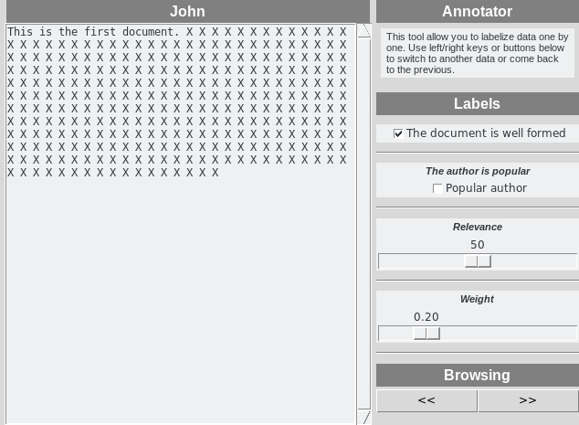

# Annotator

## Description

This tool allows users to labelize data one by one with a tkinter UI. You just need to give a set of label types and a set of data to be labelized. The interface will adapt itself. All labels will be stored either in a pickle file or in a mongo collection using a [`SerializableDict`](https://github.com/hayj/DataStructureTools).

This tool is actually in beta, it works but a lot of functionnalities has to be implemented on the fly according to your needs.

## Install

	git clone https://github.com/hayj/Annotator.git
	pip install ./Annotator/wm-dist/*.tar.gz

## Usage

First we import the lib:

	from annotator.annot import *

We get all data:

	data = \
	[
		{"author": "John", "text": "This is the first document." + " X" * 300},
		{"author": "Henry", "text": "The second doc." + " Y" * 30},
		{"author": "Roger", "text": "The third doc." + " Y" * 30},
	]

Define a function which will yield all documents as dicts with `id` (must be unique) and `content` which will contain the data you want to display. The `content` field can be a list to have mulitple columns in the UI.

	def dataGenerator():
		for current in data:
			author = current["author"]
			text = current["text"]
			yield {"id": author, "content": {"title": author, "text": text}}

Define your labels:

	labels = \
	{
		"relevance": {"title": "Relevance", "type": LABEL_TYPE.scale, "from": 0, "to": 100, "resolution": 10, "default": 50},
		"weight": {"title": "Weight", "type": LABEL_TYPE.scale, "default": 0.2},
		"format": {"title": "The document is well formed", "type": LABEL_TYPE.checkbutton, "default": True},
		"popular": {"title": "The author is popular", "shorttitle": "Popular author", "type": LABEL_TYPE.checkbutton},
	}

We init the Annotator. The first argument is the name of the file or the name of the mongo collection. Here we store all annotations in a pickle file but you can also use mongodb if you set host, user, and password:

	an = Annotator("my-annotations", labels, useMongodb=True, dirPath="/home/hayj/tmp")

Here we start the UI, so you will have one data on the left and labels on the right to be manually edited. You can click the right arrow button to switch to the next data, or return to the previous.

	an.start(dataGenerator())

Screenshot of the UI:

